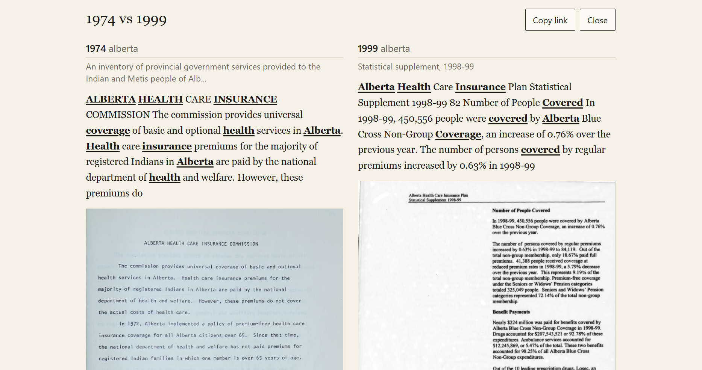
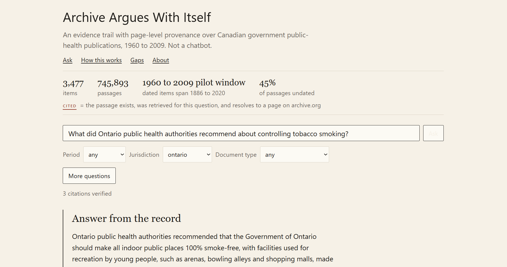
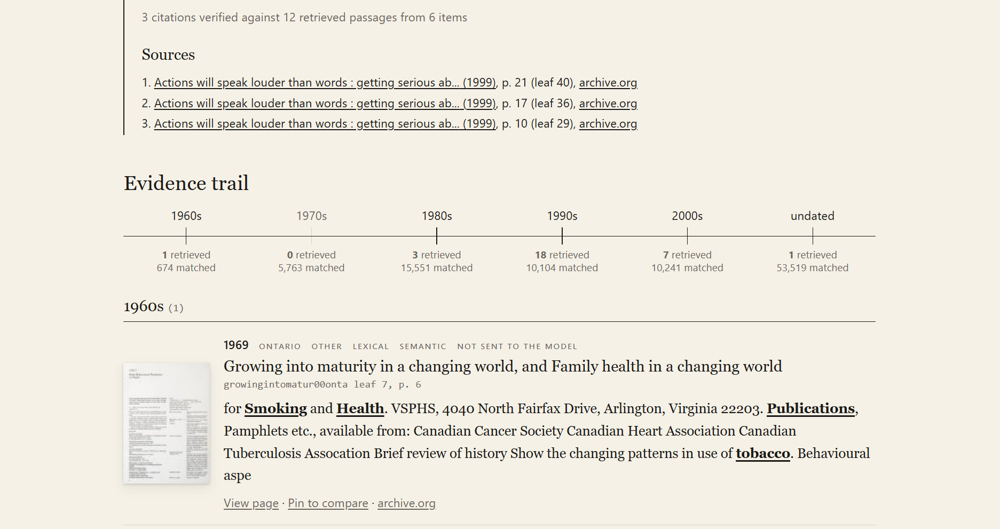
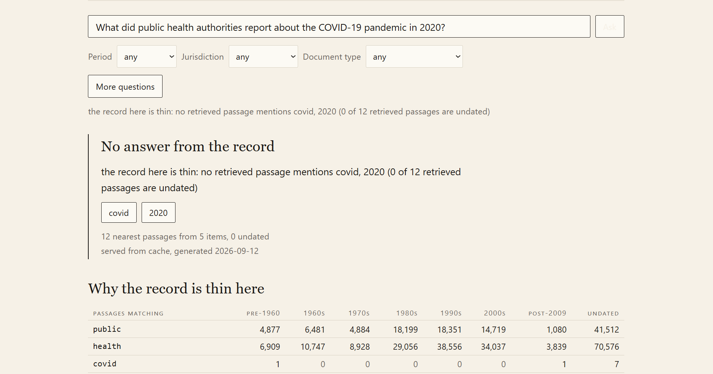
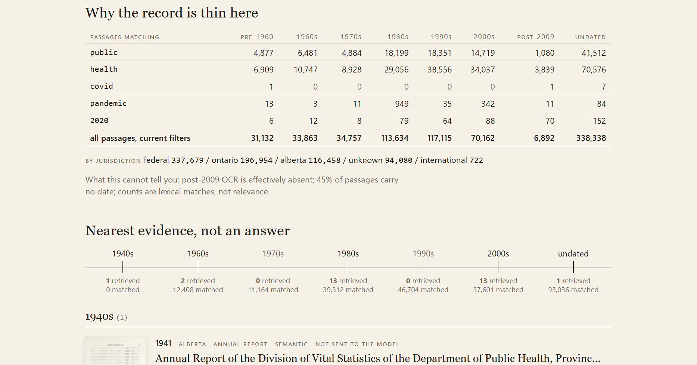

# Archive Argues With Itself

The public record disagrees with itself across decades. This tool shows you the pages.

[](https://github.com/agentjakey/archive-argues-with-itself/actions/workflows/ci.yml)
[](LICENSE)
[](pyproject.toml)
[](web/.nvmrc)
[](https://archive-argues-with-itself-production.up.railway.app)
[](https://github.com/agentjakey/archive-argues-with-itself/releases)

**Live demo:** https://archive-argues-with-itself-production.up.railway.app



An official answer is not fixed: what a government said caused a problem, or how it
described a program, changes from one decade's report to the next, and the wording of
that change is often the point. This tool puts the scanned Canadian government
public-health pages (held by the Internet Archive) in front of you, ties every sentence
of its answer to a page you can open, and says plainly where the record is too thin to
answer instead of guessing.

It serves two corpora from one app, switchable in the interface: a clean federal pilot
(Government of Canada publications, federal plus Ontario and Alberta, roughly 1960-2009)
and the national microlog microfiche corpus (federal, provincial, and municipal
issuers, 1963-2018). The data is hosted on Cloudflare R2 and cached to the deploy's disk
on boot; the pilot is also mirrored on a GitHub Release as a fallback. Neither corpus
reaches the present: scanned government OCR runs out in the 2010s, and there is no 2020s
material in this archive.

## Contents

- [What it is, and is not](#what-it-is-and-is-not)
- [The four rules](#the-four-rules)
- [The numbers](#the-numbers)
- [Quickstart](#quickstart)
- [Run it yourself](#run-it-yourself)
- [How it works](#how-it-works)
- [Methods and gaps](#methods-and-gaps)
- [Reproducing the evaluation](#reproducing-the-evaluation)
- [Contributing](#contributing)
- [Acknowledgements](#acknowledgements)
- [Citation](#citation)
- [License](#license)

## What it is, and is not

It is a civic memory debugger: page-level provenance on every claim, a comparison
view for how official language changes between decades, and a coverage view that shows
where the archive is silent or undated. It is not a chatbot. Provenance, coverage, and
uncertainty rank above fluency. The model may only write sentences it can cite to a
retrieved page, and the tool abstains when the evidence is thin. It never claims to
reach the present: the federal pilot's scanned OCR effectively stops around 2009, the
national microlog corpus reaches 2018, and neither holds 2020s material.

## The four rules

Four rules held through every stage of the work. The only network call outside the
harvest layer is the configured language-model API; nothing downstream re-fetches the
archive. Citation verification is three structural checks (the cited passage exists,
it was in the evidence retrieved for that question, it resolves to a recorded page),
and text overlap is never reported as correctness. Citations are page-level deep links
of one fixed form, with no coordinate storage. Evaluation gold is never edited to
improve a run; configuration changes are logged in `eval_runs`, and gold extensions
are additive and recorded with who decided what.

## The numbers

Each scope is evaluated on its own audit run with the shipped configuration; all labels
and judgments are by the author, and every figure links to the report it comes from.

**Federal pilot** (3,477 items, 745,893 passages; 1960-2009), audit over the 50
evaluation questions, reports under [`docs/evaluation/`](docs/evaluation/):

| what | value | source |
| --- | --- | --- |
| Citation support, strict: every claim in the sentence appears in the cited page (178 kept sentences on the 35 answerable questions) | 93.3% (166/178) | [audit report](docs/evaluation/audit_report.md) |
| Citation support, lenient: supported or partly supported | 99.4% (177/178) | [audit report](docs/evaluation/audit_report.md) |
| Cited passages that resolve to a recorded page | 119/119 | [audit report](docs/evaluation/audit_report.md) |
| Abstention on questions the archive cannot answer | 10/15 in-sample, 9/10 held out | [audit report](docs/evaluation/audit_report.md), [held-out run](docs/evaluation/holdout_run.md) |
| False abstention on answerable questions | 0/35 in-sample, 1/5 held out | [held-out run](docs/evaluation/holdout_run.md) |
| Retrieval recall@10 on the fully judged gold, before and after the retrieval changes | 0.347 to 0.4581 | [retrieval report](docs/evaluation/retrieval_report.md) |

**National microlog** (13,539 items, 1,136,827 passages; 1963-2018), audit over 47
evaluation questions, machine-readable numbers in
[`reports/microlog/audit_numbers.json`](reports/microlog/audit_numbers.json):

| what | value | source |
| --- | --- | --- |
| Claim-level citation support, strict (fully supported only), 304 kept sentences (298 supported / 6 partly / 0 not) | 98.0% (298/304) | [audit numbers](reports/microlog/audit_numbers.json) |
| Claim-level citation support, lenient (supported or partly) | 100% (304/304) | [audit numbers](reports/microlog/audit_numbers.json) |
| Cited passages that resolve to a recorded page | 200/200 | [audit numbers](reports/microlog/audit_numbers.json) |
| Abstention on should-abstain questions | 5/7 (mq43, mq44 answered off target) | [audit numbers](reports/microlog/audit_numbers.json) |
| False abstention on answerable questions | 1/40 (mq28) | [audit numbers](reports/microlog/audit_numbers.json) |
| Jurisdiction is an issuer proxy, a floor with no per-province claim (~15% unplaced, shown as its own figure) | 14.9% unknown | [audit numbers](reports/microlog/audit_numbers.json) |

Two caveats, stated in the reports: the pilot's abstention rule was amended once against
its 50 questions (its held-out set is the exception), and the candidate labels behind
the gold extensions and the sentence judgments were proposed by an assistant model of
the same family that writes the answers, then reviewed and decided by the author. See
[`docs/evaluation/abstention_sweeps.md`](docs/evaluation/abstention_sweeps.md) for the
pilot's unedited sweeps.

## Quickstart

Python 3.11 (`requires-python = ">=3.11,<3.12"`).

```powershell
git clone https://github.com/agentjakey/archive-argues-with-itself
cd archive-argues-with-itself
python -m venv .venv
.\.venv\Scripts\python.exe -m pip install -e ".[dev]"
.\.venv\Scripts\python.exe -m pytest        # hermetic: no network, no model, no index
```

The tests need no data files, no key, and no network. To serve the app you need the
corpus (next section). For synthesis, copy `.env.example` to `.env` and fill in the API
key line; the key is never committed.

## Run it yourself

Two ways to get the federal pilot's corpus database and dense index (about 3.2 GiB).
The national microlog corpus is larger and is hosted on Cloudflare R2 (see
[`docs/deploy.md`](docs/deploy.md)); the pilot below is the quickest way to run the app
locally.

**Fast path: download the data release** and verify the checksums:

```powershell
$R = "https://github.com/agentjakey/archive-argues-with-itself/releases/download/data-v1"
New-Item -ItemType Directory -Force C:\civic-data\index | Out-Null
curl.exe -L -o C:\civic-data\civic.db            "$R/civic.db"
curl.exe -L -o C:\civic-data\index\vectors.db    "$R/vectors.db"
curl.exe -L -o C:\civic-data\data-release.sha256 "$R/data-release.sha256"
# verify (Git Bash): cd /c/civic-data && sha256sum -c data-release.sha256   (vectors.db is under index/)
```

Put `CIVIC_DB_PATH=C:\civic-data\civic.db` and
`CIVIC_INDEX_PATH=C:\civic-data\index\vectors.db` in `.env` (keep the files out of
synced folders), build the web app once, and serve:

```powershell
cd web; npm ci; npm run build; cd ..
.\.venv\Scripts\python.exe -m uvicorn archive_debugger.api.app:app --host 127.0.0.1 --port 8000
```

Open `http://127.0.0.1:8000/`. Append `?kiosk=1` for the exhibit mode; see
[`docs/demo.md`](docs/demo.md) for the unattended, offline setup and
[`docs/deploy.md`](docs/deploy.md) to host both scopes (one Docker image that, on boot,
downloads each enabled scope's data from Cloudflare R2 -- the pilot also mirrored on a
GitHub Release as a fallback -- verifies the checksums, and caches them to a volume;
Railway steps; any Docker host).

**Reproducible path: rebuild from the manifest.** The item set is fixed by
[`data/manifest/`](data/manifest/); the rebuild yields the same corpus, and the dense
index is deterministic for the pinned model. Only step 1 touches the network.

```powershell
python -m archive_debugger.harvest.fetch --download-all --contact you@example.com   # 1. cache metadata + OCR under raw/
python -m archive_debugger.ingest.loader                                              # 2. load items
python -m archive_debugger.ingest.build --fresh                                       #    parse OCR into pages and passages
python -m archive_debugger.ingest.normalize                                           # 3. dates, jurisdiction, issuer, doc type
python -m archive_debugger.ingest.sections                                            #    front / body / back page classes
python -m archive_debugger.retrieve.index                                             # 4. dense index (45-90 min on CPU)
python -m archive_debugger.eval.questions --file eval/seed_questions.jsonl            # 5. evaluation questions and gold
python -m archive_debugger.eval.label --from-worksheet reports/phase7/label_worksheet.jsonl --apply-decisions eval/gold_decisions.json
python -m archive_debugger.eval.report
```

## How it works

`harvest/` caches Internet Archive metadata and existing OCR derivatives. `ingest/`
parses them into a SQLite database of items, pages, and passages, fills dates,
jurisdiction, issuer, and document type without imputation, and classifies front and
back matter. `retrieve/` fuses BM25 and dense cosine search (384-dim multilingual
MiniLM in sqlite-vec) with Reciprocal Rank Fusion, a soft OCR down-weight, front and
back demotion, and a per-item cap, then attaches page-level provenance to every hit.
`generate/` drafts cited sentences with the configured model, verifies each citation
with the three checks, drops what fails, and abstains by rule when the record is thin.
`eval/` scores retrieval against human labels and holds the labeling tools. `api/` is a
read-only FastAPI layer with an answer cache that can serve several scopes from one
process, each with its own isolated databases and a scope switcher in the UI; `web/` is
the Vite and React interface.

An answer names its sources. Every sentence carries a numbered mark, the Sources list
gives each page, and the evidence trail shows what was retrieved by decade.





When the record cannot answer, the tool refuses and shows why: the terms no retrieved
page mentions, and the coverage grid of what the archive does hold.

| The tool refusing, with the uncovered terms | The coverage behind the refusal |
| --- | --- |
|  |  |

## Methods and gaps

- [`docs/methods.md`](docs/methods.md): how the federal pilot corpus was chosen, parsed,
  indexed, retrieved, cited, and measured, every number tied to its report file.
- [`docs/gaps.md`](docs/gaps.md): what the pilot archive cannot tell you (45% undated
  passages, the pilot's record stopping around 2009, front-matter pollution, metadata
  dates that disagree with the text, why housing was not the pilot, what the abstention
  sweeps showed, and why verification checks support and not relevance).
- The national microlog scope has its own audit under
  [`reports/microlog/`](reports/microlog/) (support, abstention, the jurisdiction proxy,
  and a sensitivity review); its dated span reaches 2018.
- The same content is in the app under "How this works" and "Gaps", per scope.

## Reproducing the evaluation

The evaluation gold is committed: 50 questions in `eval/seed_questions.jsonl`, the
relevance decisions in `eval/gold_decisions.json` and the two additive extensions
`eval/gold_extension_decisions*.json`, the held-out set in
`eval/holdout_questions.jsonl`, and the sentence judgments in
`eval/judgments_phase16.json`, each with a notes file giving the reasons. The
reproducibility artifacts (worksheets, per-phase build reports, machine JSON) live
under [`reports/`](reports/). With a built `civic.db` and index in place,
`python -m archive_debugger.eval.report` writes the retrieval scores,
`python -m archive_debugger.eval.retrieval_sweep` reruns the before and after
configuration sweep, and `python scripts/audit_report.py` recomputes the five headline
numbers from the judgments into `docs/evaluation/`. Every number in this README and in
the reports comes from one of these; none is typed in by hand.

## Contributing

Issues are welcome, especially corpus gaps: a question the archive should answer and
does not, a page that resolves to the wrong scan, or a date the metadata gets wrong.
The national microlog corpus is the worked example of a second scope: a new config
(query, collections, window, and its own `[index].db_path` / `[retrieve].index_path`
under an isolated data root) registered in [`config/scopes.toml`](config/scopes.toml)
with its name and paths, then built with one resumable command; the code does not
change. The frozen public_health pilot is the base scope and stays byte-identical
whether it is served alone or alongside another scope.

```powershell
python -m archive_debugger.build_scope --scope microlog --contact you@example.com
```

The builder runs harvest -> loader -> build -> normalize -> sections -> embed for the
named scope, prints structured status only, and resumes on rerun. A scoped run uses only
that scope's registry paths and cannot open another scope's databases; the `CIVIC_DB_PATH`
/ `CIVIC_INDEX_PATH` env overrides apply to the default scope only. Every pipeline stage
also takes `--scope <name>` on its own, and the server reads `CIVIC_SCOPE`. Run the sizing
audit first. The British Columbia sizing in
[`reports/bc_audit/bc_sizing.md`](reports/bc_audit/bc_sizing.md) shows what a scope
that does not clear the item floor looks like. See [`CONTRIBUTING.md`](CONTRIBUTING.md)
and [`SECURITY.md`](SECURITY.md).

## Acknowledgements

Built during the AI Builders Fellowship of the BC + AI Ecosystem, with the Internet
Archive, whose collections, OCR, and page images make the tool possible. Page images
are served by archive.org and are not redistributed here. The publications are Canadian
government documents and remain under their own terms.

## Citation

See [`CITATION.cff`](CITATION.cff). Author: Jacob Ortiz.

## License

MIT. See [`LICENSE`](LICENSE).
